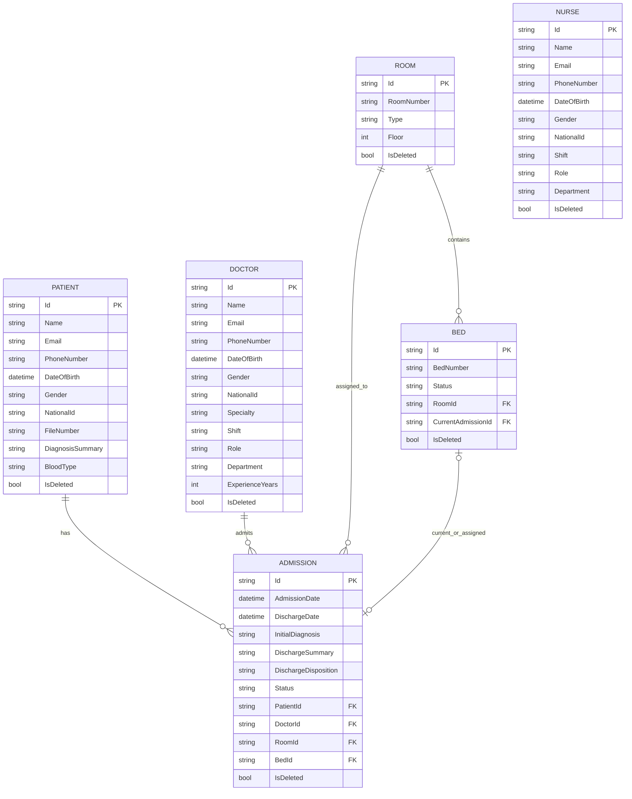
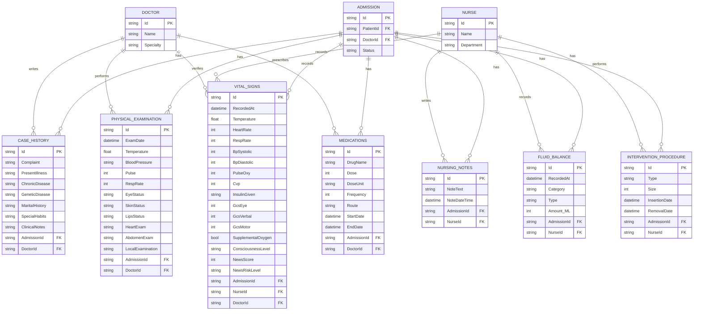
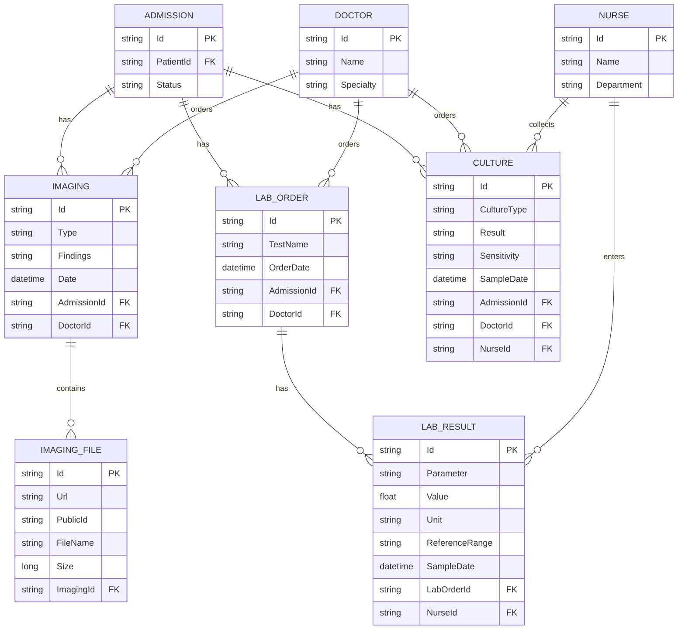
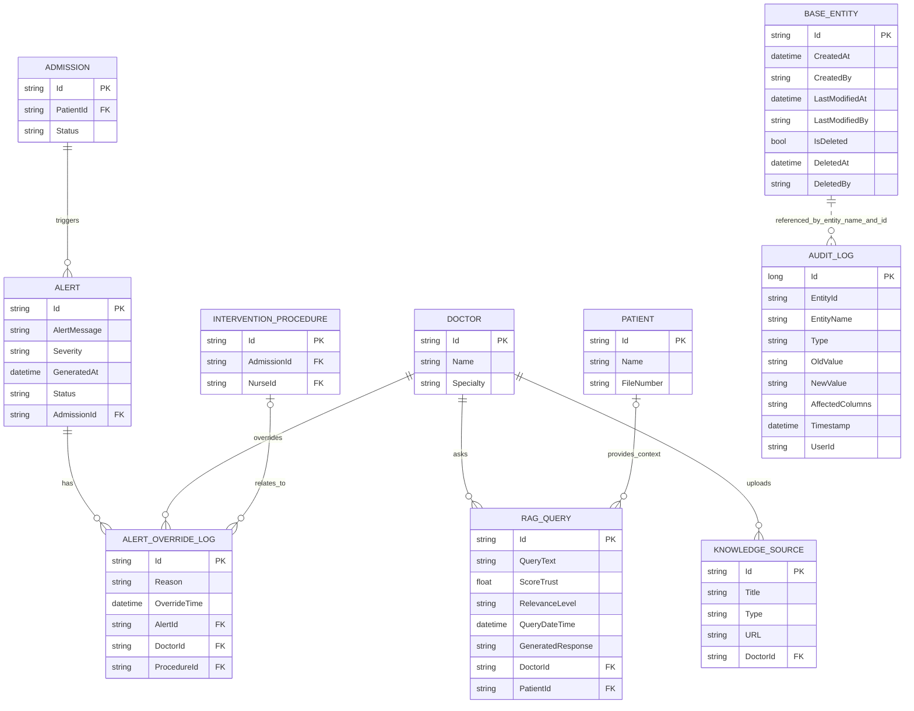

# Cortexia ERD

This document contains Mermaid ERD diagrams for the Cortexia domain model.

Source of truth:

- `Cortexa.Domain/Entities`
- `Cortexa.Domain/Common`
- `Cortexa.Infrastructure/Persistence/CortexaDbContext.cs`
- `Cortexa.Infrastructure/Persistence/Configurations`

Notes:

- `Id` values are string identifiers generated by `BaseEntity`.
- `Address` is an owned value object for users/patients, not a separate table in this ERD.
- ASP.NET Identity tables are not shown here; this ERD focuses on Cortexia domain tables.
- `AuditLog` is polymorphic by `EntityName` and `EntityId`, so it does not have a normal FK to each audited table.

## 0. Full Domain ERD

```mermaid
erDiagram
  PATIENT ||--o{ ADMISSION : has
  DOCTOR ||--o{ ADMISSION : admits
  ROOM ||--o{ BED : contains
  ROOM ||--o{ ADMISSION : assigned_to
  BED o|--o| ADMISSION : current_or_assigned

  ADMISSION ||--o{ VITAL_SIGNS : records
  ADMISSION ||--o{ CASE_HISTORY : has
  ADMISSION ||--o{ PHYSICAL_EXAMINATION : has
  ADMISSION ||--o{ NURSING_NOTES : has
  ADMISSION ||--o{ MEDICATIONS : has
  ADMISSION ||--o{ FLUID_BALANCE : has
  ADMISSION ||--o{ INTERVENTION_PROCEDURE : has

  NURSE ||--o{ VITAL_SIGNS : records
  DOCTOR ||--o{ VITAL_SIGNS : verifies
  DOCTOR ||--o{ CASE_HISTORY : writes
  DOCTOR ||--o{ PHYSICAL_EXAMINATION : performs
  NURSE ||--o{ NURSING_NOTES : writes
  DOCTOR ||--o{ MEDICATIONS : prescribes
  NURSE ||--o{ FLUID_BALANCE : records
  NURSE ||--o{ INTERVENTION_PROCEDURE : performs

  ADMISSION ||--o{ LAB_ORDER : has
  LAB_ORDER ||--o{ LAB_RESULT : has
  ADMISSION ||--o{ IMAGING : has
  IMAGING ||--o{ IMAGING_FILE : contains
  ADMISSION ||--o{ CULTURE : has

  DOCTOR ||--o{ LAB_ORDER : orders
  NURSE ||--o{ LAB_RESULT : enters
  DOCTOR ||--o{ IMAGING : orders
  DOCTOR ||--o{ CULTURE : orders
  NURSE ||--o{ CULTURE : collects

  ADMISSION ||--o{ ALERT : triggers
  ALERT ||--o{ ALERT_OVERRIDE_LOG : has
  DOCTOR ||--o{ ALERT_OVERRIDE_LOG : overrides
  INTERVENTION_PROCEDURE o|--o{ ALERT_OVERRIDE_LOG : relates_to

  DOCTOR ||--o{ RAG_QUERY : asks
  PATIENT o|--o{ RAG_QUERY : provides_context
  DOCTOR ||--o{ KNOWLEDGE_SOURCE : uploads

  BASE_ENTITY ||..o{ AUDIT_LOG : referenced_by_entity_name_and_id

  PATIENT {
    string Id PK
    string Name
    string NationalId
    string FileNumber
  }

  DOCTOR {
    string Id PK
    string Name
    string Specialty
    string Department
  }

  NURSE {
    string Id PK
    string Name
    string Department
  }

  ADMISSION {
    string Id PK
    string PatientId FK
    string DoctorId FK
    string RoomId FK
    string BedId FK
    string Status
  }

  ROOM {
    string Id PK
    string RoomNumber
    string Type
    int Floor
  }

  BED {
    string Id PK
    string BedNumber
    string Status
    string RoomId FK
    string CurrentAdmissionId FK
  }

  VITAL_SIGNS {
    string Id PK
    string AdmissionId FK
    string NurseId FK
    string DoctorId FK
    int NewsScore
    string NewsRiskLevel
  }

  CASE_HISTORY {
    string Id PK
    string AdmissionId FK
    string DoctorId FK
  }

  PHYSICAL_EXAMINATION {
    string Id PK
    string AdmissionId FK
    string DoctorId FK
  }

  NURSING_NOTES {
    string Id PK
    string AdmissionId FK
    string NurseId FK
  }

  MEDICATIONS {
    string Id PK
    string AdmissionId FK
    string DoctorId FK
    string DrugName
  }

  FLUID_BALANCE {
    string Id PK
    string AdmissionId FK
    string NurseId FK
  }

  INTERVENTION_PROCEDURE {
    string Id PK
    string AdmissionId FK
    string NurseId FK
  }

  LAB_ORDER {
    string Id PK
    string AdmissionId FK
    string DoctorId FK
    string TestName
  }

  LAB_RESULT {
    string Id PK
    string LabOrderId FK
    string NurseId FK
    string Parameter
  }

  IMAGING {
    string Id PK
    string AdmissionId FK
    string DoctorId FK
    string Type
  }

  IMAGING_FILE {
    string Id PK
    string ImagingId FK
    string Url
    string PublicId
  }

  CULTURE {
    string Id PK
    string AdmissionId FK
    string DoctorId FK
    string NurseId FK
    string CultureType
  }

  ALERT {
    string Id PK
    string AdmissionId FK
    string Severity
    string Status
  }

  ALERT_OVERRIDE_LOG {
    string Id PK
    string AlertId FK
    string DoctorId FK
    string ProcedureId FK
  }

  RAG_QUERY {
    string Id PK
    string DoctorId FK
    string PatientId FK
    string RelevanceLevel
  }

  KNOWLEDGE_SOURCE {
    string Id PK
    string DoctorId FK
    string Title
    string Type
  }

  AUDIT_LOG {
    long Id PK
    string EntityId
    string EntityName
    string Type
  }

  BASE_ENTITY {
    string Id PK
    bool IsDeleted
  }
```

## 1. Core Hospital Model

## 2. Clinical Data Model

## 3. Diagnostics Model

## 4. AI, RAG, Alerts, and Audit Model

## Relationship Summary

| Parent | Child | Relationship |
| --- | --- | --- |
| Patient | Admission | One patient can have many admissions |
| Doctor | Admission | One doctor can admit many patients |
| Room | Bed | One room contains many beds |
| Admission | Clinical records | One admission owns many clinical records |
| Admission | Diagnostics | One admission owns lab orders, imaging, and cultures |
| LabOrder | LabResult | One lab order can have many results |
| Admission | Alert | One admission can have many alerts |
| Alert | AlertOverrideLog | One alert can have many override logs |
| Doctor | RAGQuery | One doctor can ask many RAG queries |
| Patient | RAGQuery | A RAG query can optionally have patient context |
| Doctor | KnowledgeSource | One doctor can upload many knowledge sources |
