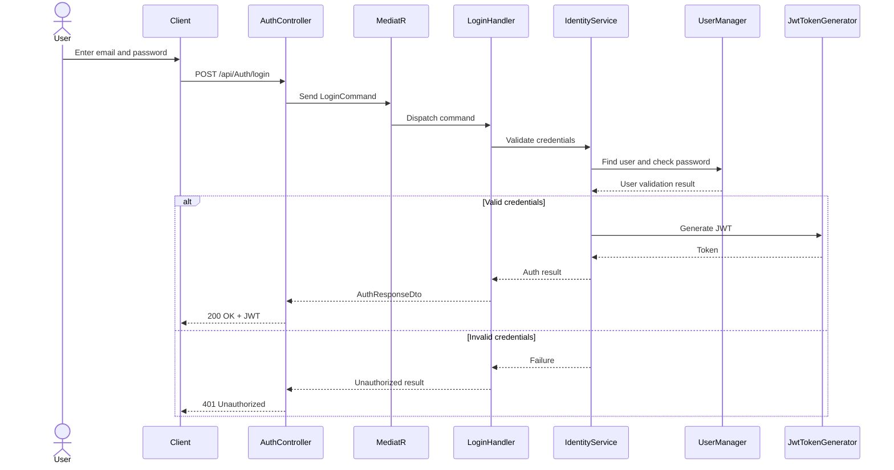
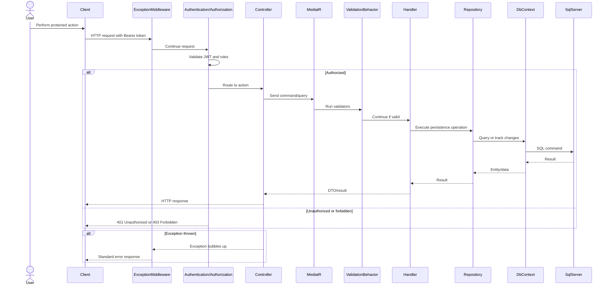
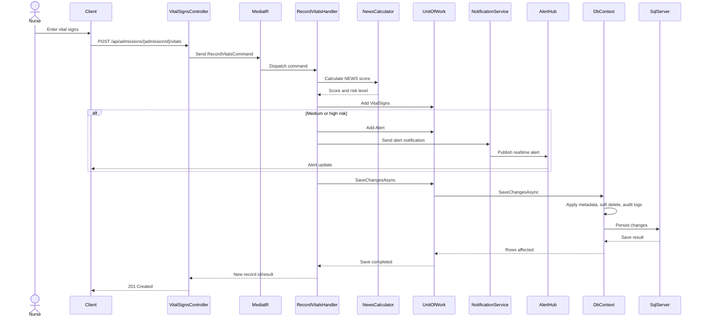
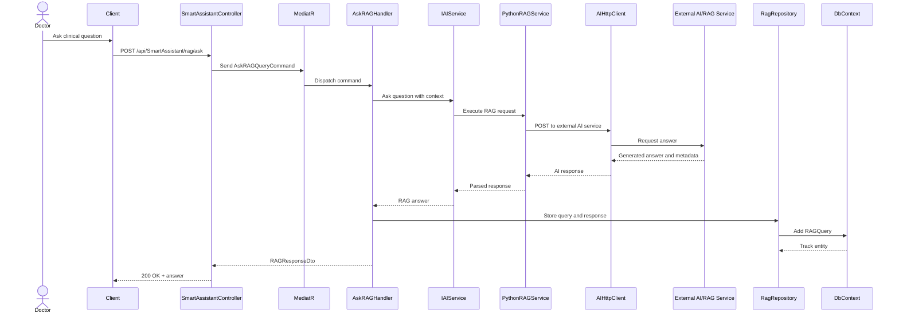
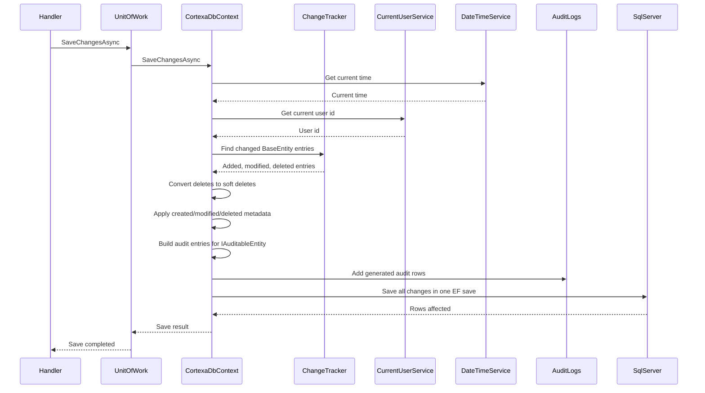

# Cortexia Sequence Diagrams

This document contains Mermaid sequence diagrams for important Cortexia runtime flows.

Source of truth:

- `Cortexa.Api/Program.cs`
- `Cortexa.Api/Controllers`
- `Cortexa.Application/Features`
- `Cortexa.Infrastructure/DependencyInjection.cs`
- `Cortexa.Infrastructure/Persistence/CortexaDbContext.cs`
- `Cortexa.Infrastructure/External`

## 1. Login and JWT Issuing

## 2. Authenticated API Request

## 3. Record Vital Signs and Trigger Alert

## 4. Smart Assistant RAG Question

## 5. EF Core Save, Soft Delete, and Audit

