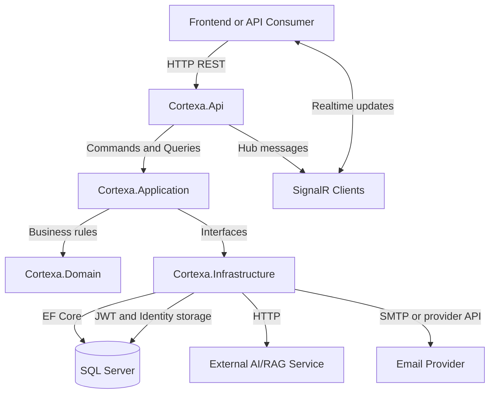
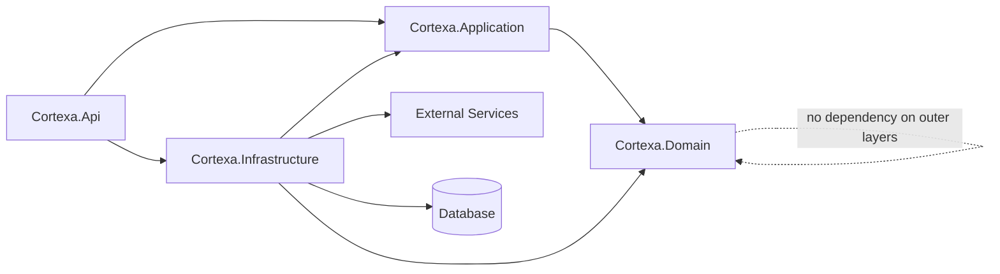
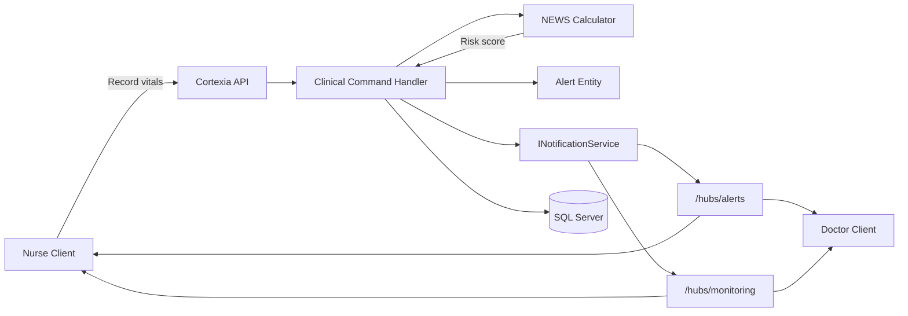
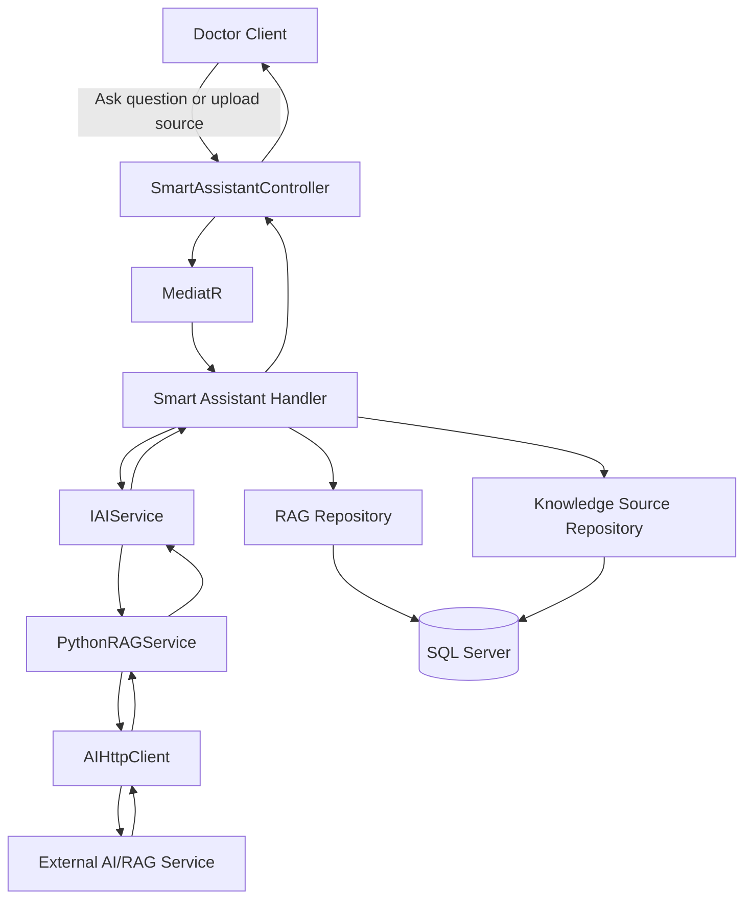
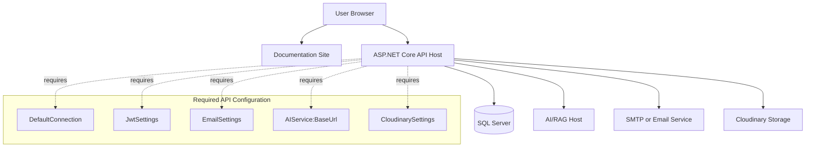

# Cortexia System Design Diagrams

This document contains Mermaid diagrams that describe Cortexia from a system design perspective.

These diagrams focus on runtime boundaries, dependencies, and infrastructure flow. For entity relationships, use [ERD.md](./ERD.md). For object structure, use [UML.md](./UML.md). For runtime interactions, use [Sequence.md](./Sequence.md).

## System Design

## 2. Clean Architecture Dependency Direction

## 3. Backend Runtime Request Path

```mermaid
flowchart LR
  Client[Client]
  Middleware[ASP.NET Core Middleware]
  Auth[JWT Authentication and Authorization]
  Controller[API Controller]
  MediatR[MediatR]
  Validation[Validation Behavior]
  Handler[Application Handler]
  UnitOfWork[UnitOfWork and Repositories]
  DbContext[CortexaDbContext]
  Sql[(SQL Server)]

  Client --> Middleware
  Middleware --> Auth
  Auth --> Controller
  Controller --> MediatR
  MediatR --> Validation
  Validation --> Handler
  Handler --> UnitOfWork
  UnitOfWork --> DbContext
  DbContext --> Sql
  Sql --> DbContext
  DbContext --> UnitOfWork
  UnitOfWork --> Handler
  Handler --> Controller
  Controller --> Client
```

## 5. Realtime Monitoring and Alert Design

## 6. Smart Assistant System Design

## 7. Deployment Dependency View

