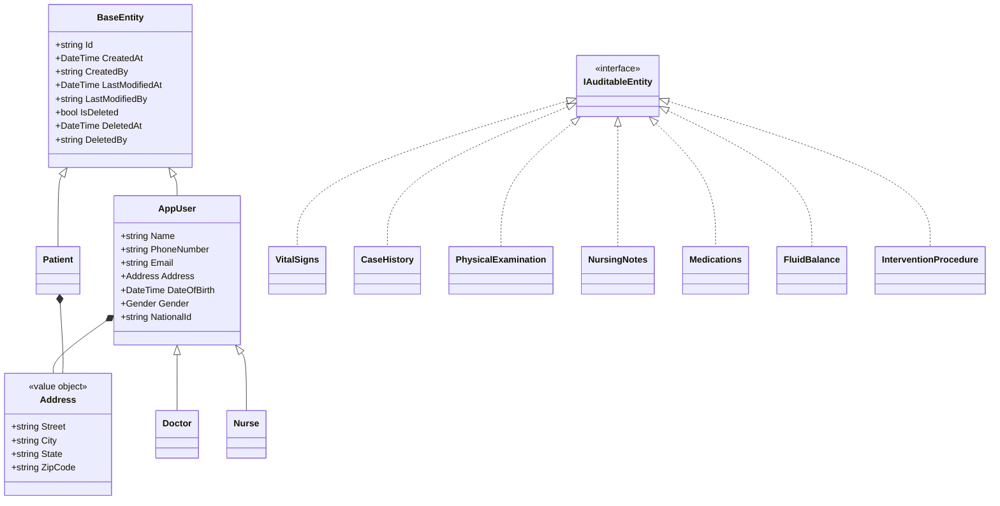
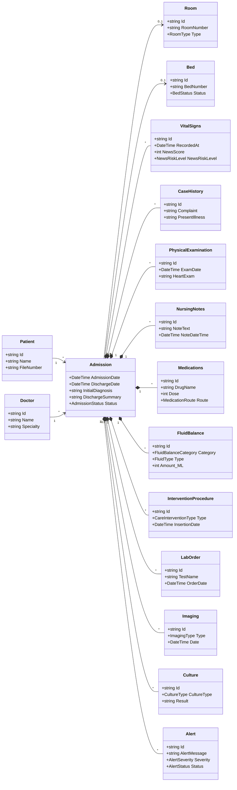
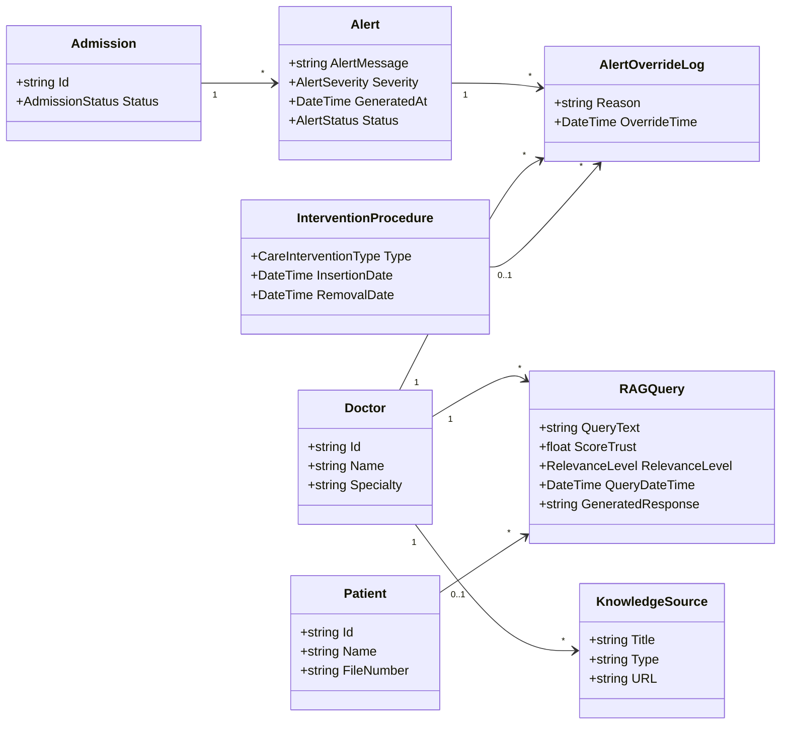

# Cortexia UML

This document contains Mermaid UML-style class diagrams for the Cortexia domain model.

Source of truth:

- `Cortexa.Domain/Common`
- `Cortexa.Domain/Entities`
- `Cortexa.Domain/ValueObjects`
- `Cortexa.Infrastructure/Persistence/Configurations`

Notes:

- These diagrams describe the object model, not the physical database schema.
- `BaseEntity` provides shared identity, audit metadata, and soft-delete fields.
- `AppUser` is a domain base class for `Doctor` and `Nurse`.
- `Address` and `BloodPressure` are value objects.

## 1. Full Domain UML

```mermaid
classDiagram
  direction LR

  class BaseEntity {
    +string Id
    +DateTime CreatedAt
    +string CreatedBy
    +DateTime LastModifiedAt
    +string LastModifiedBy
    +bool IsDeleted
    +DateTime DeletedAt
    +string DeletedBy
  }

  class IAuditableEntity {
    <<marker interface>>
    Audited by CortexaDbContext
  }

  class AppUser {
    +string Name
    +string PhoneNumber
    +string Email
    +Address Address
    +DateTime DateOfBirth
    +Gender Gender
    +string NationalId
  }

  class Address {
    <<value object>>
    +string Street
    +string City
    +string State
    +string ZipCode
  }

  class Patient {
    +string Name
    +string Email
    +string PhoneNumber
    +DateTime DateOfBirth
    +Gender Gender
    +Address Address
    +string NationalId
    +string FileNumber
    +string DiagnosisSummary
    +BloodType BloodType
  }

  class Doctor {
    +string Specialty
    +ShiftType Shift
    +DoctorRole Role
    +string Department
    +int ExperienceYears
  }

  class Nurse {
    +ShiftType Shift
    +NurseRole Role
    +string Department
  }

  class Admission {
    +DateTime AdmissionDate
    +DateTime DischargeDate
    +string InitialDiagnosis
    +string DischargeSummary
    +DischargeDisposition DischargeDisposition
    +AdmissionStatus Status
  }

  class Room {
    +string RoomNumber
    +RoomType Type
    +int Floor
  }

  class Bed {
    +string BedNumber
    +BedStatus Status
  }

  class VitalSigns {
    +DateTime RecordedAt
    +float Temperature
    +int HeartRate
    +int RespRate
    +int BpSystolic
    +int BpDiastolic
    +int PulseOxy
    +int Cvp
    +int GcsEye
    +int GcsVerbal
    +int GcsMotor
    +int NewsScore
    +NewsRiskLevel NewsRiskLevel
    +int GcsTotal
  }

  class CaseHistory {
    +string Complaint
    +string PresentIllness
    +string ChronicDisease
    +string GeneticDisease
    +string MaritalHistory
    +string SpecialHabits
    +string ClinicalNotes
  }

  class PhysicalExamination {
    +DateTime ExamDate
    +float Temperature
    +string BloodPressure
    +int Pulse
    +int RespRate
    +string HeartExam
    +string AbdomenExam
    +string LocalExamination
  }

  class NursingNotes {
    +string NoteText
    +DateTime NoteDateTime
  }

  class Medications {
    +string DrugName
    +int Dose
    +string DoseUnit
    +int Frequency
    +MedicationRoute Route
    +DateTime StartDate
    +DateTime EndDate
  }

  class FluidBalance {
    +DateTime RecordedAt
    +FluidBalanceCategory Category
    +FluidType Type
    +int Amount_ML
  }

  class InterventionProcedure {
    +CareInterventionType Type
    +int Size
    +DateTime InsertionDate
    +DateTime RemovalDate
  }

  class LabOrder {
    +string TestName
    +DateTime OrderDate
  }

  class LabResult {
    +string Parameter
    +float Value
    +string Unit
    +string ReferenceRange
    +DateTime SampleDate
  }

  class Imaging {
    +ImagingType Type
    +string Findings
    +DateTime Date
  }

  class ImagingFile {
    +string Url
    +string PublicId
    +string FileName
    +long Size
  }

  class Culture {
    +CultureType CultureType
    +string Result
    +string Sensitivity
    +DateTime SampleDate
  }

  class Alert {
    +string AlertMessage
    +AlertSeverity Severity
    +DateTime GeneratedAt
    +AlertStatus Status
  }

  class AlertOverrideLog {
    +string Reason
    +DateTime OverrideTime
  }

  class RAGQuery {
    +string QueryText
    +float ScoreTrust
    +RelevanceLevel RelevanceLevel
    +DateTime QueryDateTime
    +string GeneratedResponse
  }

  class KnowledgeSource {
    +string Title
    +string Type
    +string URL
  }

  class AuditLog {
    +long Id
    +string EntityId
    +string EntityName
    +AuditType Type
    +string OldValue
    +string NewValue
    +string AffectedColumns
    +DateTime Timestamp
    +string UserId
  }

  BaseEntity <|-- Patient
  BaseEntity <|-- AppUser
  AppUser <|-- Doctor
  AppUser <|-- Nurse
  BaseEntity <|-- Admission
  BaseEntity <|-- Room
  BaseEntity <|-- Bed
  BaseEntity <|-- VitalSigns
  BaseEntity <|-- CaseHistory
  BaseEntity <|-- PhysicalExamination
  BaseEntity <|-- NursingNotes
  BaseEntity <|-- Medications
  BaseEntity <|-- FluidBalance
  BaseEntity <|-- InterventionProcedure
  BaseEntity <|-- LabOrder
  BaseEntity <|-- LabResult
  BaseEntity <|-- Imaging
  BaseEntity <|-- ImagingFile
  BaseEntity <|-- Culture
  BaseEntity <|-- Alert
  BaseEntity <|-- AlertOverrideLog
  BaseEntity <|-- RAGQuery
  BaseEntity <|-- KnowledgeSource

  IAuditableEntity <|.. VitalSigns
  IAuditableEntity <|.. CaseHistory
  IAuditableEntity <|.. PhysicalExamination
  IAuditableEntity <|.. NursingNotes
  IAuditableEntity <|.. Medications
  IAuditableEntity <|.. FluidBalance
  IAuditableEntity <|.. InterventionProcedure

  Patient *-- Address
  AppUser *-- Address

  Patient "1" --> "*" Admission
  Doctor "1" --> "*" Admission
  Room "1" --> "*" Bed
  Admission "0..1" --> "0..1" Bed
  Admission "0..1" --> "0..1" Room

  Admission "1" --> "*" VitalSigns
  Admission "1" --> "*" CaseHistory
  Admission "1" --> "*" PhysicalExamination
  Admission "1" --> "*" NursingNotes
  Admission "1" --> "*" Medications
  Admission "1" --> "*" FluidBalance
  Admission "1" --> "*" InterventionProcedure

  Admission "1" --> "*" LabOrder
  LabOrder "1" --> "*" LabResult
  Admission "1" --> "*" Imaging
  Imaging "1" --> "*" ImagingFile
  Admission "1" --> "*" Culture

  Admission "1" --> "*" Alert
  Alert "1" --> "*" AlertOverrideLog
  Doctor "1" --> "*" RAGQuery
  Patient "0..1" --> "*" RAGQuery
  Doctor "1" --> "*" KnowledgeSource
```

## 2. Inheritance and Shared Types

## 3. Admission Aggregate

## 4. Smart Assistant UML

