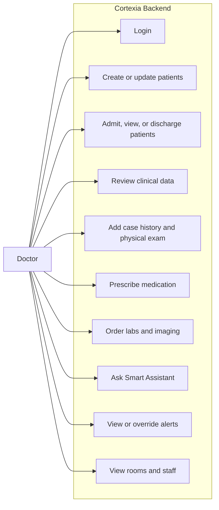
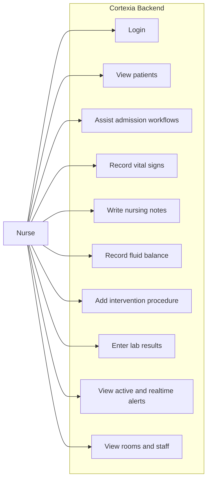
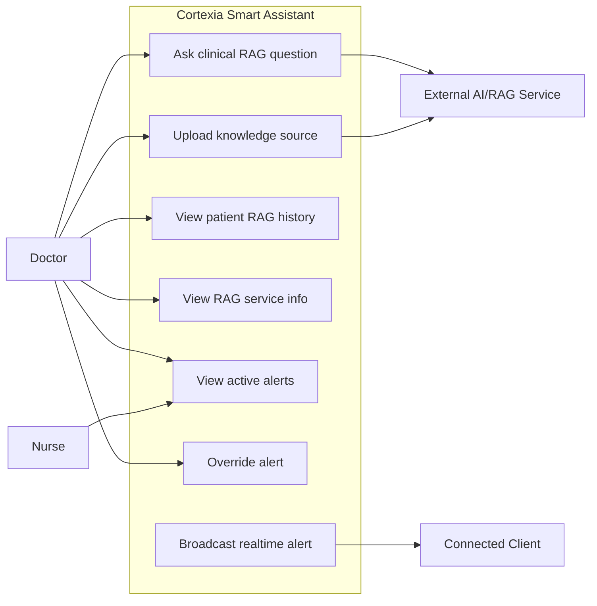
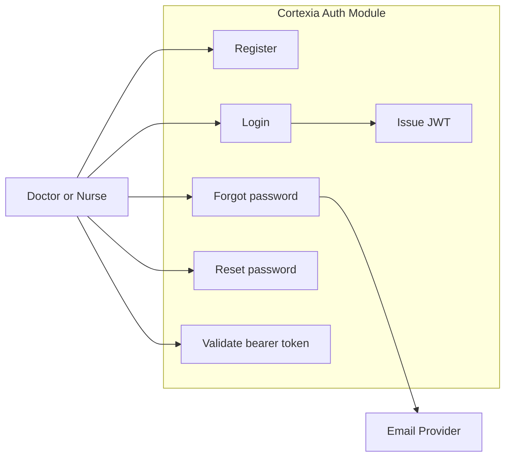

# Cortexia Use Case Diagrams

This document contains Mermaid use-case-style diagrams for Cortexia.

Mermaid does not provide a native UML use-case diagram syntax, so these diagrams use `flowchart` with:

- Actors outside the system boundary.
- Use cases inside grouped subgraphs.
- Directed links from actors to the use cases they initiate.

## 1. Full System Use Case Diagram

```mermaid
flowchart LR
  Doctor[Doctor]
  Nurse[Nurse]
  Admin[Admin or Staff Manager]
  Client[Frontend Client]
  AIService[External AI/RAG Service]
  EmailProvider[Email Provider]

  subgraph Cortexia[Cortexia Backend]
    subgraph Auth[Authentication]
      Register[Register user]
      Login[Login]
      ForgotPassword[Request password reset]
      ResetPassword[Reset password]
    end

    subgraph PatientCare[Patient and Admission Care]
      CreatePatient[Create patient]
      UpdatePatient[Update patient]
      ViewPatients[View patients]
      AdmitPatient[Admit patient]
      ViewAdmissions[View admissions]
      DischargeAdmission[Discharge admission]
      AssignBed[Assign room and bed]
    end

    subgraph Clinical[Clinical Documentation]
      RecordVitals[Record vital signs]
      ReviewVitals[Review vitals history]
      AddCaseHistory[Add case history]
      AddPhysicalExam[Add physical examination]
      AddNursingNote[Add nursing note]
      PrescribeMedication[Prescribe medication]
      RecordFluidBalance[Record fluid balance]
      AddIntervention[Add intervention procedure]
    end

    subgraph Diagnostics[Diagnostics]
      CreateLabOrder[Create lab order]
      AddLabResult[Add lab result]
      UploadImaging[Upload imaging]
      ViewDiagnostics[View diagnostics]
    end

    subgraph SmartAssistant[Smart Assistant and Alerts]
      AskRAG[Ask RAG question]
      UploadKnowledge[Upload knowledge source]
      ViewRAGHistory[View patient RAG history]
      ViewActiveAlerts[View active alerts]
      OverrideAlert[Override alert]
      ReceiveRealtimeAlert[Receive realtime alert]
    end

    subgraph StaffRooms[Staff and Rooms]
      ViewDoctors[View doctors]
      ViewOnDutyNurses[View on-duty nurses]
      ViewRooms[View rooms]
    end
  end

  Doctor --> Register
  Nurse --> Register
  Doctor --> Login
  Nurse --> Login
  Doctor --> ForgotPassword
  Nurse --> ForgotPassword
  Doctor --> ResetPassword
  Nurse --> ResetPassword

  Doctor --> CreatePatient
  Nurse --> CreatePatient
  Doctor --> UpdatePatient
  Nurse --> UpdatePatient
  Doctor --> ViewPatients
  Nurse --> ViewPatients
  Doctor --> AdmitPatient
  Nurse --> AdmitPatient
  Doctor --> ViewAdmissions
  Nurse --> ViewAdmissions
  Doctor --> DischargeAdmission
  Nurse --> DischargeAdmission
  Doctor --> AssignBed
  Nurse --> AssignBed

  Nurse --> RecordVitals
  Doctor --> ReviewVitals
  Nurse --> ReviewVitals
  Doctor --> AddCaseHistory
  Doctor --> AddPhysicalExam
  Nurse --> AddNursingNote
  Doctor --> PrescribeMedication
  Nurse --> RecordFluidBalance
  Nurse --> AddIntervention

  Doctor --> CreateLabOrder
  Nurse --> AddLabResult
  Doctor --> UploadImaging
  Doctor --> ViewDiagnostics
  Nurse --> ViewDiagnostics

  Doctor --> AskRAG
  Doctor --> UploadKnowledge
  Doctor --> ViewRAGHistory
  Doctor --> ViewActiveAlerts
  Nurse --> ViewActiveAlerts
  Doctor --> OverrideAlert
  Doctor --> ReceiveRealtimeAlert
  Nurse --> ReceiveRealtimeAlert

  Doctor --> ViewDoctors
  Nurse --> ViewDoctors
  Doctor --> ViewOnDutyNurses
  Nurse --> ViewOnDutyNurses
  Doctor --> ViewRooms
  Nurse --> ViewRooms

  Client --> Login
  Client --> ReceiveRealtimeAlert
  AskRAG --> AIService
  UploadKnowledge --> AIService
  ForgotPassword --> EmailProvider
```

## 2. Doctor Use Cases

## 3. Nurse Use Cases

## 4. Smart Assistant Use Cases

## 5. Authentication and Recovery Use Cases

