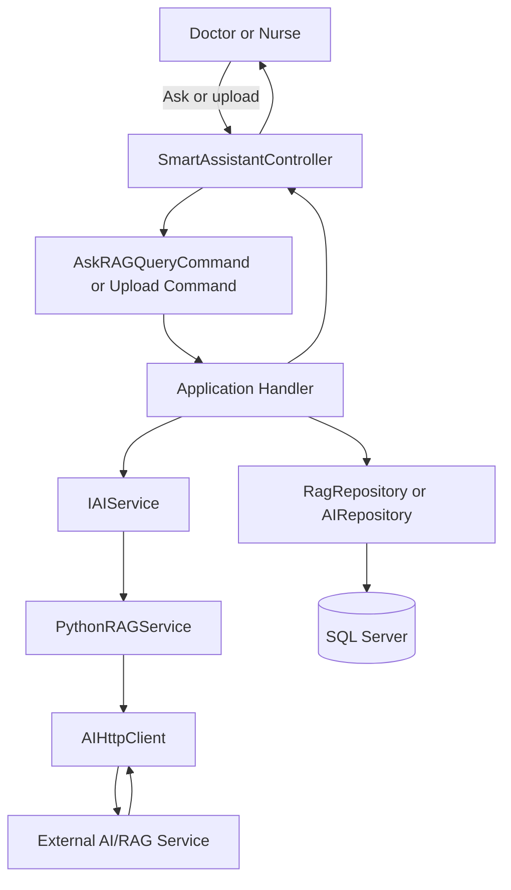

Cortexia includes a Smart Assistant module backed by an external AI/RAG service.

Key backend pieces:

- `SmartAssistantController`
- `IAIService`
- `PythonRAGService`
- `AIHttpClient`
- `RAGQuery`
- `KnowledgeSource`

## Responsibilities

The API accepts smart assistant requests, while Infrastructure handles communication with the external AI service.

The database stores RAG queries and knowledge source metadata so assistant interactions can be associated with patient context.

