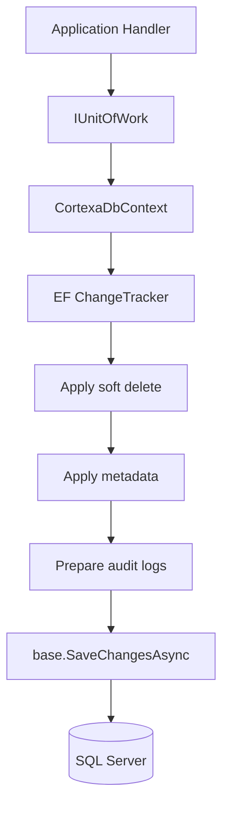

Cortexia uses Entity Framework Core with SQL Server.

The main DbContext is:

```text
Cortexa.Infrastructure/Persistence/CortexaDbContext.cs
```

## Persistence Behavior

`SaveChangesAsync` applies extra behavior before writing to SQL Server:

- Soft delete conversion
- Created and modified metadata
- Deleted metadata
- Audit log generation for auditable entities



## Soft Delete

Entities derived from the base entity receive a global query filter that excludes soft-deleted records.

Delete operations are converted into updates that set deletion metadata instead of physically removing the row.
