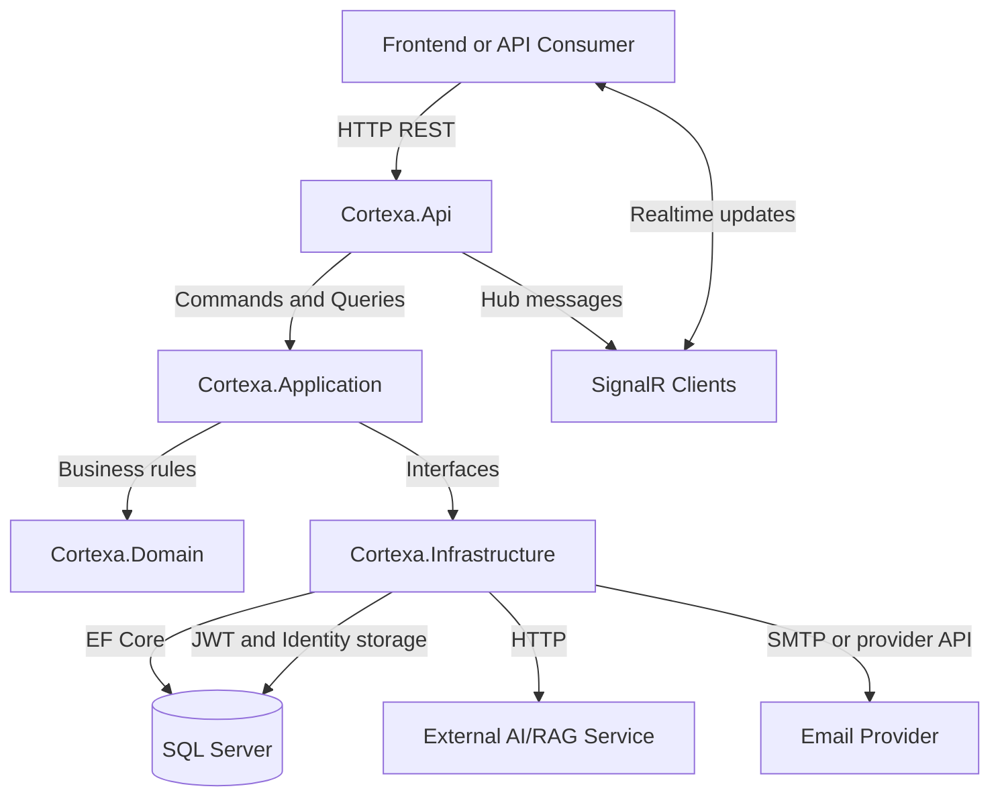

Cortexia follows a layered, Clean Architecture-style backend structure.

```text
Cortexa.Api
  -> Cortexa.Application
    -> Cortexa.Domain
  -> Cortexa.Infrastructure
```

The dependency direction keeps business logic away from HTTP and persistence details.

## Layer Responsibilities

| Layer | Responsibility |
| --- | --- |
| API | Controllers, middleware, filters, Swagger, SignalR hubs |
| Application | Commands, queries, handlers, DTOs, validation, mapping |
| Domain | Entities, enums, value objects, domain services, domain exceptions |
| Infrastructure | EF Core, repositories, Identity, JWT, external services |

## System Design



## Main Pattern

Controllers stay thin. They receive HTTP input, create commands or queries, and send them through MediatR.

Application handlers perform use-case logic and call interfaces implemented by Infrastructure.
