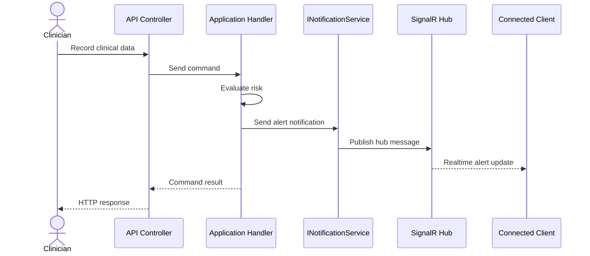

Cortexia uses SignalR for realtime notifications.

Mapped hubs:

```text
/hubs/alerts
/hubs/monitoring
```

The API layer registers `SignalRNotificationService` as the implementation of `INotificationService`.

Typical use case:

1. Clinical data is recorded.
2. The application handler detects a risky condition.
3. An alert is created.
4. A SignalR notification is sent to connected clients.


