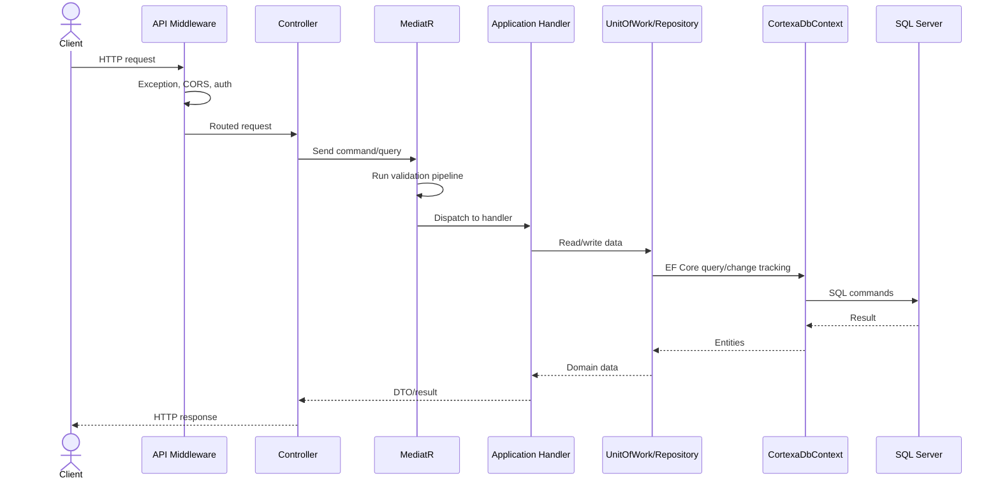
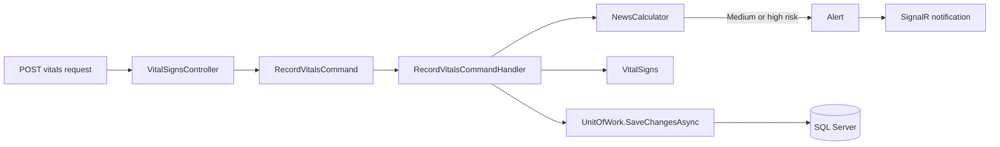

Most API requests follow this path:

```text
Client
-> ASP.NET Core middleware
-> Controller
-> MediatR command/query
-> Application handler
-> Repository or UnitOfWork
-> CortexaDbContext
-> SQL Server
-> Response
```



## Pipeline

The request pipeline is configured in `Cortexa.Api/Program.cs`.

Key runtime steps:

1. `ExceptionMiddleware`
2. CORS
3. Authentication
4. Authorization
5. Controllers
6. SignalR hubs

## Example: Record Vital Signs

Endpoint:

```http
POST /api/admissions/{admissionId}/vitals
```

Flow:

1. `VitalSignsController` receives the request.
2. The controller sends `RecordVitalsCommand` through MediatR.
3. The handler creates a `VitalSigns` entity.
4. The NEWS score is calculated by the domain service.
5. Risky readings can create alerts.
6. A SignalR notification can be sent.
7. The Unit of Work persists the changes.
8. The controller returns the HTTP response.


